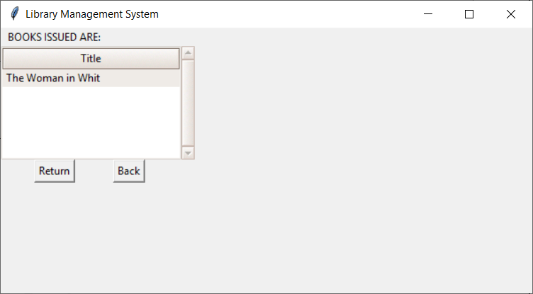

# Library-Management-System
#### Using Python and MongoDB to built a system to handle the primary housekeeping functions of a library.
 

The following functionalities have been implemented:
- User login
- Register new user
- Search book (by title, author or genre)
- Issue books and return books
- Recommend books
 

Here are a few snapshots:  

**Login**: Registered users can login.  
  

**Register**: New users can create an account.  
  

**Home Page**: The user can select any of the main functionalities.  
  

**Recommended**: Set of recommended books is displayed for the user to select. If the user is new then the most popular books are displayed.  
  

**Return Book**: The user can return any issued book and see if any fine is applicable.  
  

**Search Books**: The user can search for a book based on title, author or genre.  
  

**Search By Title**: Search is based on Title.  
  
  

**Search By Author**: Search is based on Author’s name.  
  
  

**Search By Genre**: List of all genres is displayed for the user to select.  
  
  
 

**Refer the 'Project Report' for an in-depth understanding of this system.**
